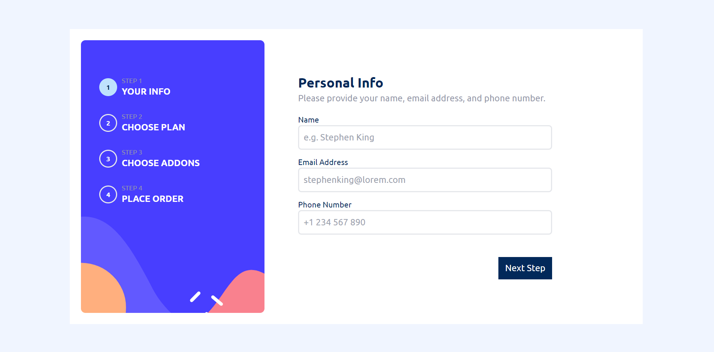

# Frontend Mentor - Multi-step form solution

This is my solution to the [Multi-step form challenge on Frontend Mentor](https://www.frontendmentor.io/challenges/multistep-form-YVAnSdqQBJ).

## Table of contents

- [Overview](#overview)
  - [The challenge](#the-challenge)
  - [Screenshot](#screenshot)
  - [Links](#links)
- [My process](#my-process)
  - [Built with](#built-with)
- [Author](#author)

## Overview

### The challenge

Users should be able to:

- Complete each step of the sequence
- Go back to a previous step to update their selections
- See a summary of their selections on the final step and confirm their order
- View the optimal layout for the interface depending on their device's screen size
- See hover and focus states for all interactive elements on the page
- Receive form validation messages if:
  - A field has been missed
  - The email address is not formatted correctly

### Screenshot

### Links

- Solution URL: [Github](https://github.com/herecomesfed/multistep-subscription)
- Live Site URL: [Vercel](https://multistep-subscription-sooty.vercel.app/)

## My process

### Built with

- React
- React Router
- Typescript
- Tailwind

## Author

- Website - [grazianifederico.it](https://grazianifederico.it)
- Frontend Mentor - [@herecomesfed](https://www.frontendmentor.io/profile/herecomesfed)
